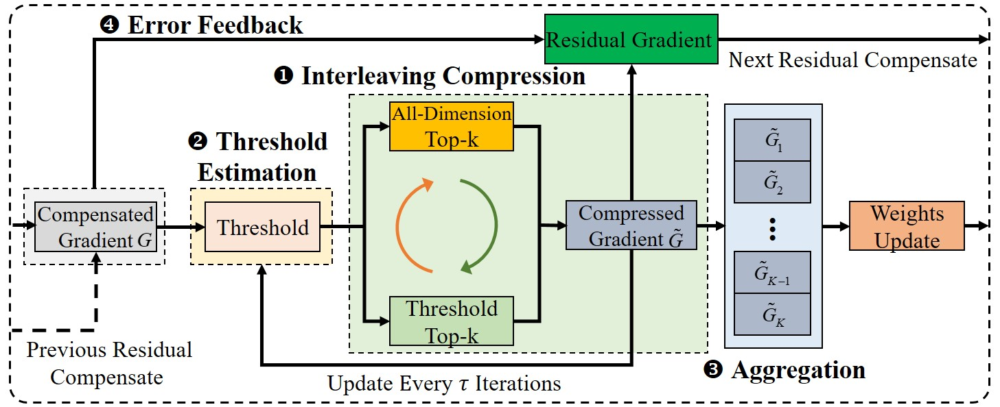

# ADTopk
__ADTopk__  is an all-dimension Top-k sparsification scheme, which selects the largest 𝑘 elements from all dimensions of the gradient in each layer, meaning that each dimension must provide some elements, so as to avoid the dimension missing. Further, __ADTopk__ enables each dimension to perform sorting locally within the elements of the dimension, and thus all dimensions can perform multiple local sortings independently and parallelly, instead of a single global sorting for the entire gradient in each layer. 

On top of __ADTopk__, we further propose an interleaving compression scheme and an efficient threshold estimation algorithm so as to enhance the performance of __ADTopk__. We build a sparsification compression data-parallel DNN training framework and implement a compression library containing state-of-the-art sparsification algorithms.


# Introduction

This code repository covers:

### ADTopk

- __ADTopk__ with a quantity-based inter-worker buffering method to control the consistency of the gradient type and number buffered by inter-worker during each gradient merging.
- An interleaving compression scheme that accelerates model convergence and an efficient threshold estimation algorithm that reduces the compression overhead.

### State-of-the-art gradient sparsification compression methods.

- [DGC](https://arxiv.org/pdf/1712.01887.pdf)
- [Gaussiank](https://arxiv.org/pdf/1911.08772.pdf)
- [Redsync](https://www.sciencedirect.com/science/article/pii/S0743731518308657)
- [OkTopk](https://dl.acm.org/doi/abs/10.1145/3503221.3508399)
- [SIDCo](https://proceedings.mlsys.org/paper_files/paper/2021/file/fea47a8aa372e42f3c84327aec9506cf-Paper.pdf)

# Implementation

We use the PyTorch framework and implemented the prototype system of __ADTopk__ based on the [Horovod](https://github.com/horovod/horovod) framework using NCCL as the communication library. Overview of our system is as follows.

<!--  -->
<center class ='img'>

</center>

# Installation
### Prerequisites
- CUDA-11.6
- NCCL-2.8.3
- PyTorch-1.3.+
- [OpenMPI-4.0.+](https://www-lb.open-mpi.org/software/ompi/v4.0/)
- [Horovod-0.27.+](https://github.com/horovod/horovod)

### Install ADTopk
```
git clone https://github.com/User/ADTopk.git
cd ADTopk
pip install -r requirements.txt
HOROVOD_GPU_OPERATIONS=NCCL pip install horovod==0.21.3
pip install -e .
```

# Quick start
To run CV jobs:
```
cd ./examples/cv_examples/
bash run.sh
```
To run NLP jobs:
```
cd ./examples/nlp_examples/bert/pytorch/scripts
bash run_squad.sh
```

# Papers
- ADTopk: All-Dimension Top-k Compression for High-Performance Data-Parallel DNN Training


# Referred Datasets

- CIFAR-100: [https://www.cs.utoronto.ca/~kriz/cifar.html](https://www.cs.utoronto.ca/~kriz/cifar.html)
- ImageNet: [https://www.image-net.org/](https://www.image-net.org/)
- Wikitex-2/103: [https://huggingface.co/datasets/wikitext](https://huggingface.co/datasets/wikitext)
- SQuAD: [https://rajpurkar.github.io/SQuAD-explorer/](https://rajpurkar.github.io/SQuAD-explorer/)

# License

See [LICENSE](https://github.com/ATC24-FGBuff/FGBuff/blob/main/LICENSE.txt).
