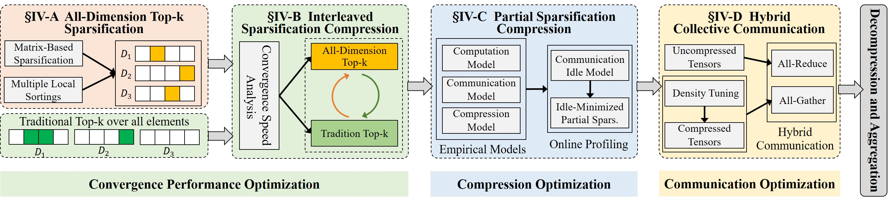

# Enabling Efficient All-Dimension Top-k Sparsification for High-Performance Distributed DNN Training Systems
__ADTopk__  is an all-dimension top-𝑘 sparsification scheme that selects the 𝑘 largest elements across all dimensions of the per-layer gradient tensor, ensuring that every dimension contributes at least one element and eliminating dimension missing. __ADTopk__ also enables independent local sorting within each dimension, allowing parallel execution across dimensions to enhance GPU utilization. Furthermore, we enhance __ADTopk__ with system-level optimizations: (i) interleaved sparsification to accelerate convergence, (ii) partial sparsification to reduce sparsification overhead, and (iii) hybrid collective communication to improve sparse communication efficiency. 
We implement a high-performance distributed DNN training framework with a modular sparsification compression library supporting __ADTopk__ and state-of-the-art gradient sparsification baselines. We also develop collective communication libraries to support different sparsification communication primitives.
 <!-- We also prove the stable convergence of __ADTopk__ distributed SGD theoretically and experimentally. -->


# Introduction

This code repository covers:

### ADTopk Framework

- __ADTopk__ avoids dimension missing via a matrix-based sparsification to enhance convergence accuracy, and increases GPU core parallelism via a multiple local sorting to improve sparsification efficiency.
- __ADTopk__ employs an interleaved sparsification scheme to combine ADTopk and the traditional Top-𝑘 to speed up the convergence.
- __ADTopk__ employs a partial sparsification scheme via minimizing communication idle periods to to reduce the sparsification overhead.
- __ADTopk__ employs a hybrid collective communication that combines All-Reduce and All-Gather to improve sparse communication efficiency.


### State-of-the-art gradient sparsification methods.


- [DGC](https://arxiv.org/pdf/1712.01887.pdf)
- [Gaussiank](https://arxiv.org/pdf/1911.08772.pdf)
- [Redsync](https://www.sciencedirect.com/science/article/pii/S0743731518308657)
- [OkTopk](https://dl.acm.org/doi/abs/10.1145/3503221.3508399)
- [SIDCo](https://proceedings.mlsys.org/paper_files/paper/2021/file/fea47a8aa372e42f3c84327aec9506cf-Paper.pdf)
- [HiPress](https://gitlab.com/hipress/hipress)
- [Espresso](https://github.com/zhuangwang93/Espresso)


# Implementation
## **__ADTopk__** System Architecture
We implement __ADTopk__, which mainly consists of five main modules, an all-dimension Top-𝑘 sparsification module, an interleaved sparsification module, a partial sparsification module, a hybrid collective communication module, and a decompression and averaging module. 
We also implement an experimental proof module to prove the stable convergence of __ADTopk__ distributed SGD on multiple training tasks.

We use the PyTorch framework and implemented the prototype system of __ADTopk__ based on the [Horovod](https://github.com/horovod/horovod) framework using NCCL as the communication library. Overview of our system is as follows.

## **__ADTopk__** System Overview
The workflow of the __ADTopk__ System：

<!--  -->
<center class ='img'>

</center>
# Installation
## **Prerequisites**
- [CUDA-12.0](https://developer.nvidia.com/cuda-12-0-0-download-archive)
- [Python >= 3.12](https://www.python.org/downloads/release/python-312)
- [NCCL-2.8.3](https://github.com/NVIDIA/nccl)
- [PyTorch-2.3.+](https://github.com/pytorch/pytorch)
- [OpenMPI-4.0.+](https://www-lb.open-mpi.org/software/ompi/v4.0/)
- [Horovod-0.28.1+](https://github.com/horovod/horovod)
- [Numpy](https://github.com/numpy/numpy)
- [TensorboardX](https://github.com/lanpa/tensorboardX)
- [Tqdm](https://github.com/tqdm/tqdm)


### Install ADTopk
```
git clone https://github.com/zqming-cs/ADTopk.git
cd ADTopk
pip install -r requirements.txt
HOROVOD_GPU_OPERATIONS=NCCL pip install horovod==0.28.1
pip install -e .
```

## **Quick start**

The primary benchmark is provided in `examples`. 
For example, we can use the following command to run the benchmark on 8 GPUs, with sparsification algorithm as adtopk, gaussiank, sidco, and dgc, communication primitives as All-Reduce and All-Gather, memory as residual.
 
**To run BERT-large training job:**
```
cd ADTopk/examples/nlp_examples/bert/scripts
bash run_squad_bert.sh
```

**To run GPT2-large training job:**
```
cd ADTopk/examples/nlp_examples/gpt
bash run_clm_no_trainer_hvd_103.sh
```

**To run ViT-large training job:**
```
cd ADTopk/examples/cv_examples/vit
bash run_imagenet_no_trainer.sh
```

**To run ResNet-152 training job:**
```
cd ADTopk/example/cv_examples/resnet
bash run_imagenet_resnet152.sh
```


# Papers
An 11-page conference version of this paper appeared in the _Proceedings of the 33rd International Symposium on High-Performance Parallel and Distributed Computing (HPDC2024)_, June 2024.
In this extended version, we enhanced ADTopk with new system-level optimizations, including partial sparsification and hybrid collective communication. We also include new evaluation results and show that our enhanced ADTopk increases training throughput by up to 268.0%.


- Enabling Efficient All-Dimension Top-k Sparsification for High-Performance Distributed DNN Training Systems


If you are using this repository for your paper, please cite our previous work
```
@inproceedings{ming2024adtopk,
  title={ADTopk: All-Dimension Top-k Compression for High-Performance Data-Parallel DNN Training},
  author={Zhangqiang, Ming and Yuchong, Hu and Wenxiang, Zhou and Xinjue, Zheng and Chenxuan, Yao and Dan, Feng},
  booktitle={Proceedings of the 33nd International Symposium on High-Performance Parallel and Distributed Computing},
  url={https://doi.org/10.1145/3625549.3658678}
  year={2024}
}
```

# Referred Datasets
- Wikitex-2/103: [https://huggingface.co/datasets/wikitext](https://huggingface.co/datasets/wikitext)
- SQuAD: [https://rajpurkar.github.io/SQuAD-explorer/](https://rajpurkar.github.io/SQuAD-explorer/)
- ImageNet: [https://www.image-net.org/](https://www.image-net.org/)
- CIFAR-100: [https://www.cs.utoronto.ca/~kriz/cifar.html](https://www.cs.utoronto.ca/~kriz/cifar.html)


# License
See [LICENSE](https://github.com/zqming-cs/ADTopk/blob/main/LICENSE).


